<p align="center">
  
</p>

<p align="center">
  I turn raw data into <strong>explainable models, useful insights, and complete products</strong>.
  <br />
  My work spans machine learning, analytics, generative AI, and full-stack data applications.
</p>

<p align="center">
  <a href="https://saanvi-portfolio-kappa.vercel.app/">
    
  </a>
  <a href="https://www.linkedin.com/in/saanvi-grover-01a4b41b7">
    
  </a>
  <a href="mailto:saanvigrover2007@gmail.com">
    
  </a>
</p>

<p align="center">
  
  <a href="LICENSE"></a>
</p>

---

## About me

```python
saanvi = {
    "role": "Computer Science student and Data & AI builder",
    "focus": ["Machine Learning", "Data Science", "Generative AI"],
    "interests": ["Explainable AI", "Workforce Intelligence", "Analytics"],
    "building": "Practical systems that turn data into decisions",
}
```

- 🔭 I build projects end to end—from data collection and EDA to model development, APIs, deployment, and interactive interfaces.
- 🧠 I care about explainability, responsible automation, and making complex analysis genuinely useful.
- 🏆 **Finalist, ANALYTICA 2026** National-Level Data Science Hackathon — built the AI backend for a RAG + NL→SQL system over real ARGO ocean data.
- 🌱 I’m currently deepening my skills in generative AI, MLOps, data engineering, and cloud deployment.
- 💬 Ask me about Python, SQL, machine learning, RAG / LLM applications, Power BI, or full-stack data development.

---

## Selected work

<table>
  <tr>
    <td width="50%" valign="top">
      <h3>🌊 FloatChat</h3>
      <p>The AI backend for a system that answers plain-language questions over 12,442 real ARGO ocean-float profiles: RAG-over-schema, natural-language→SQL, and a query safety layer. <em>Finalist, ANALYTICA 2026 (Team Entropy).</em></p>
      <p><strong>Python · RAG · NL→SQL · PostgreSQL · PostGIS · FastAPI</strong></p>
    </td>
    <td width="50%" valign="top">
      <h3><a href="https://github.com/SaiGrover/SkillLens">🎯 SkillLens</a></h3>
      <p>An AI-powered workforce intelligence platform for skill forecasting, industry insights, and evidence-based career planning. Built during a mentorship at Persistent Systems.</p>
      <p><strong>Machine Learning · K-Means · Analytics · Forecasting</strong></p>
    </td>
  </tr>
  <tr>
    <td width="50%" valign="top">
      <h3><a href="https://github.com/SaiGrover/HeatFluxAI">🌍 HeatFluxAI</a></h3>
      <p>A machine-learning system estimating urban heat island intensity across 25 global cities from ERA5 and MODIS data; eight regression models compared, best RMSE ≈ 2.14°C with XGBoost.</p>
      <p><strong>Python · XGBoost · Feature Engineering · Streamlit</strong></p>
    </td>
    <td width="50%" valign="top">
      <h3><a href="https://github.com/SaiGrover/TalentScope">👥 HR TalentScope</a></h3>
      <p>An HR analytics platform on 19,000+ employee records that predicts attrition risk; five ML models compared with a 10+ module workforce-insight dashboard.</p>
      <p><strong>Python · Classification · EDA · Analytics</strong></p>
    </td>
  </tr>
  <tr>
    <td width="50%" valign="top">
      <h3><a href="https://github.com/SaiGrover/Campus-Lens">🎓 Campus Lens</a></h3>
      <p>A text-mining platform that classifies student complaints and surfaces recurring issues, locations, and trends for institutions.</p>
      <p><strong>Text Classification · NLP · Next.js · Data Science</strong></p>
    </td>
    <td width="50%" valign="top">
      <h3><a href="https://github.com/SaiGrover/DataStory-AI">✨ DataStory AI</a></h3>
      <p>An AI-assisted data workspace that cleans CSVs, automates EDA, handles class imbalance, and tunes ML models via grid search.</p>
      <p><strong>AutoML · EDA · GridSearchCV · Plotly</strong></p>
    </td>
  </tr>
</table>

<p align="center">
  <a href="https://github.com/SaiGrover?tab=repositories">
    
  </a>
</p>

---

## Technology toolkit

<p><strong>Languages</strong></p>
<p>
  
  
  
  
  
</p>

<p><strong>Data, machine learning & AI</strong></p>
<p>
  
  
  
  
  
  
  
  
</p>

<p><strong>Applications, APIs & data stores</strong></p>
<p>
  
  
  
  
  
  
  
  
  
  
</p>

<p><strong>Developer tools & deployment</strong></p>
<p>
  
  
  
  
</p>

---

## Highlights

- 🏆 **Finalist** — ANALYTICA 2026 National-Level Data Science Hackathon (VESASC, Mumbai)
- 🏆 **Finalist** — Statistella BASH 8.0 Data Analytics Competition (with Rank 1, Tableau Dashboard Design Round 1)
- 🎓 **Certification in AI & ML** — Vishlesan i-Hub, IIT Patna / Masai (CGPA 9.16, 3 Certificates of Excellence)
- 🎓 **Google Advanced Data Analytics** and **Google AI Essentials**
- ✅ **HackerRank** — SQL Basic, Intermediate & Advanced; Python Basic

---

## Contribution activity

<p align="center">
  <a href="https://github.com/SaiGrover">
    
  </a>
</p>

---

## Let’s build something useful

If you’re working on an idea involving **machine learning, analytics, explainable AI, generative AI, or data-driven products**, I’d be happy to connect.

<p align="center">
  <a href="mailto:saanvigrover2007@gmail.com"><strong>Email me</strong></a>
  &nbsp;•&nbsp;
  <a href="https://www.linkedin.com/in/saanvi-grover-01a4b41b7"><strong>Connect on LinkedIn</strong></a>
  &nbsp;•&nbsp;
  <a href="https://saanvi-portfolio-kappa.vercel.app/"><strong>Visit my portfolio</strong></a>
</p>

---

<p align="center">
  <em>“Building practical AI solutions that transform data into meaningful impact.”</em>
</p>

<p align="center">
  <sub>
    Copyright © 2026 Saanvi Grover. All rights reserved.<br />
    Unless expressly stated otherwise, no permission is granted to copy, modify, distribute, commercialize, or create derivative works from my original work without prior direct written permission. See <a href="LICENSE">LICENSE</a>.
  </sub>
</p>

<p align="center">
  
</p>
